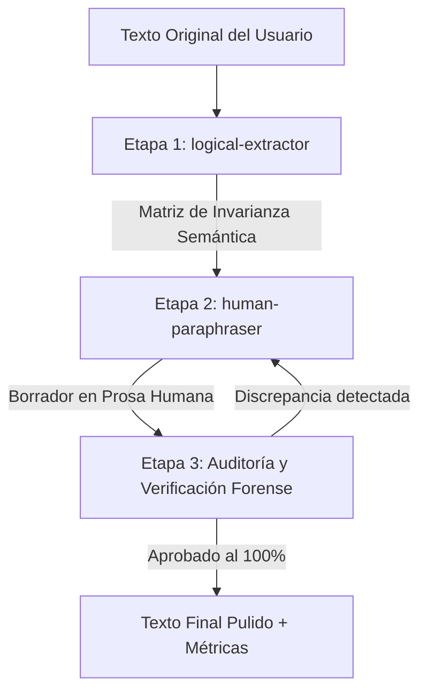

# Workflow: Parafraseo Humano Forense (`/paraphrase`)

Este flujo de trabajo implementa un pipeline de tres etapas para reescribir y elevar la calidad de textos académicos y analíticos en español. Integra los patrones open-source de **Fabric** (`analyze_prose`, `improve_writing`, `write_essay`) adaptados para garantizar **naturalidad humana, ritmo vibrante (*burstiness*), voz activa y blindaje absoluto de la verdad factual**.

---

## 🧭 Pipeline de Ejecución en 3 Etapas



---

## Etapa 1: Extracción y Blindaje Lógico (`logical-extractor`)
> **Habilidad activada:** [logical-extractor](file:///c:/GRESLY/.agent/skills/logical-extractor/SKILL.md)

1. **Lectura y segmentación:** Analizar el texto fuente y descomponerlo en proposiciones nucleares.
2. **Identificación de la Tesis:** Aislar la conclusión o afirmación central irrenunciable.
3. **Mapeo Causal ($A \implies B$):** Registrar las cadenas de causa y efecto para evitar que la reescritura invierta o diluya la causalidad.
4. **Catálogo de Evidencia Inmutable:**
   - Cifras exactas, porcentajes, medidas físicas y temporales.
   - Topónimos, instituciones y resoluciones normativas.
   - Nombres propios, citas de autores y referencias bibliográficas (Vancouver).
   - Vocablos originarios o especializados (ej. terminología Quechua Chanka).
5. **Construir la Matriz de Invarianza Semántica:**

```markdown
### MATRIZ DE INVARIANZA SEMÁNTICA PRELIMINAR
- **Tesis Central:** [Idea directriz]
- **Nexo Causal Clave:** [Causa A] ➔ [Efecto B]
- **Datos Inmutables:** [Cifras, citas, topónimos, fechas]
- **Restricciones Semánticas:** Prohibido alterar la conclusión o diluir los hechos.
```

---

## Etapa 2: Reescritura Humana y Estilización (`human-paraphraser`)
> **Habilidad activada:** [human-paraphraser](file:///c:/GRESLY/.agent/skills/human-paraphraser/SKILL.md)

Tomando como insumo el texto original y la Matriz de Invarianza Semántica, redactar la nueva versión aplicando los cuatro principios del estilo humano:

1. **Aplicar *Burstiness* Estricto (Variación Rítmica):**
   - **Frases Cortas (4-9 palabras):** Para fijar tesis y generar impacto conceptual.
   - **Frases Medianas (10-18 palabras):** Para desarrollar explicaciones y articular la narrativa.
   - **Frases Largas (20-35 palabras):** Para integrar causalidades multifactoriales y fundamentación teórica.
   - *Regla:* Romper activamente la cadencia monótona de 20 palabras por frase típica de los LLMs.

2. **Voz Activa y Verbos Fuertes:**
   - Eliminar pasivas innecesarias ("fue observado por") y gerundios de relleno ("evidenciando", "demostrando").
   - Poner al sujeto y a la acción en primer plano con verbos vigorosos.

3. **Purga Total de la Lista Negra de Clichés de IA:**
   - Prohibido terminantemente: *"Es crucial destacar"*, *"Cabe resaltar que"*, *"Juega un papel fundamental"*, *"En el vertiginoso mundo"*, *"Un faro de esperanza"*, *"En conclusión"*, *"En resumen"*, *"Un mosaico de complejidades"*.
   - Transiciones orgánicas y directas al grano.

---

## Etapa 3: Auditoría y Verificación de Invarianza Semántica
Antes de entregar el resultado, el agente debe verificar metódicamente:

1. **Verificación Factual:** ¿Cada cifra, fecha, porcentaje y topónimo del texto original está idéntico en la nueva versión?
2. **Verificación Causal:** ¿La relación de causalidad sigue intacta sin inversiones ni ambigüedades?
3. **Verificación de Citas:** ¿Se mantuvieron las citas, normas y vocablos especializados sin distorsión?
4. **Verificación Anticliché:** ¿El texto final está 100% libre de giros y muletillas sintéticas?
5. **Cálculo de Métricas:** Medir la longitud de oraciones (mínima, máxima, promedio) para comprobar la variación rítmica.

---

## 📤 Formato de Salida al Usuario

Cuando el usuario invoque `/paraphrase <texto o referencia a archivo>`, la respuesta debe estructurarse con la siguiente plantilla:

```markdown
### 🛡️ 1. Matriz de Invarianza Semántica (logical-extractor)
| Componente | Elemento Original Blindado | Estado |
|---|---|:---:|
| **Tesis** | [Texto clave] | Inalterado |
| **Causalidad** | [Causa ➔ Efecto] | Preservado |
| **Datos Duros** | [Cifras / Citas / Topónimos] | 100% Fiel |

---

### ✍️ 2. Texto Parafraseado (Prosa Humana Pulida)
[Inserción del texto reescrito en español fluido, rítmico y con voz activa]

---

### 📊 3. Auditoría de Estilo y Métricas de Burstiness
- **Variación de Frases:** Mínimo: X palabras | Máximo: Y palabras | Promedio: Z palabras.
- **Voz y Sintaxis:** Voz activa predominante, gerundios reducidos al mínimo necesario.
- **Filtro de Clichés de IA:** 0 fórmulas sintéticas detectadas (Superado con éxito).
- **Fidelidad Semántica:** 100% de invarianza conceptual y fáctica.
```
