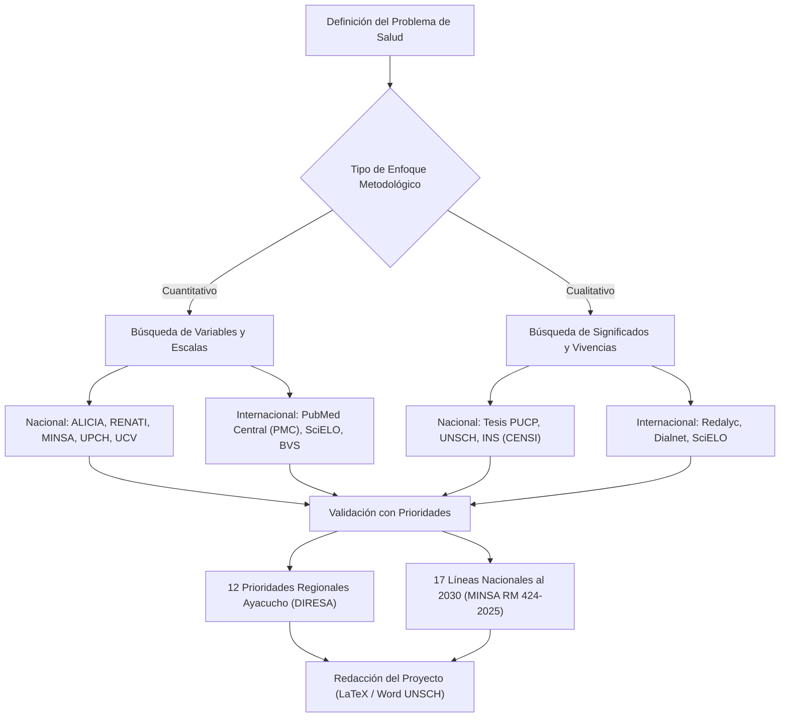

# GUÍA MAESTRA DE REPOSITORIOS Y FUENTES DE INFORMACIÓN CIENTÍFICA EN SALUD
## Proyecto de Investigación en Salud (EN 486)
**Universidad Nacional de San Cristóbal de Huamanga (UNSCH)**  
**Facultad de Ciencias de la Salud — Escuela Profesional de Enfermería**  
**Cátedra:** Dr. Manglio Aguirre Andrade  
**Área:** Metodología de la Investigación Científica en Salud (Enfoques Cuantitativo y Cualitativo)  
**Fecha de actualización:** Septiembre 2026 | **Versión:** 1.0.0  

---

## 1. PRESENTACIÓN Y ALCANCE

Para la elaboración rigurosa de protocolos de investigación y tesis de grado en enfermería y ciencias de la salud, la recopilación de antecedentes empíricos, marcos contextuales y fundamentación teórico-científica debe sustentarse en **fuentes primarias e indexadas de acceso abierto**.

El presente compendio sistematiza los **20 repositorios académicos y bases de datos bibliográficas esenciales** (10 Repositorios Nacionales del Perú y 10 Repositorios Internacionales de Iberoamérica y el Mundo). Todos los portales han sido **verificados, descargados y archivados localmente** en el workspace `C:\GRESLY\DOCUMENTOS\REPOSITORIOS\descargas\` para consulta offline y auditoría bibliográfica.

---

## 2. TABLA MAESTRA CONSOLIDADA: ENLACES WEB Y ARCHIVOS LOCALES DESCARGADOS

| # | Repositorio / Fuente | Alcance | Enlace Web Oficial (URL) | Archivo Local Descargado | Tamaño | Hash SHA-256 (Integridad) |
|:---:|---|:---:|---|---|:---:|:---:|
| **01** | **ALICIA (CONCYTEC)** | Nacional (Perú) | [https://alicia.concytec.gob.pe](https://alicia.concytec.gob.pe) | [01_alicia_concytec.html](file:///C:/GRESLY/DOCUMENTOS/REPOSITORIOS/descargas/01_alicia_concytec.html) | 35.8 KB | `8A157355F6DCB84A...` |
| **02** | **RENATI (SUNEDU)** | Nacional (Perú) | [https://renati.sunedu.gob.pe](https://renati.sunedu.gob.pe) | [02_renati_sunedu.html](file:///C:/GRESLY/DOCUMENTOS/REPOSITORIOS/descargas/02_renati_sunedu.html) | 7.6 KB | `9E49DBF3EBE181D1...` |
| **03** | **Repositorio Institucional MINSA** | Nacional (Perú) | [https://repositorio.minsa.gob.pe](https://repositorio.minsa.gob.pe) | [03_repositorio_minsa.html](file:///C:/GRESLY/DOCUMENTOS/REPOSITORIOS/descargas/03_repositorio_minsa.html) | 26.0 KB | `199E5D9478D11031...` |
| **04** | **Repositorio INS (Instituto Nac. de Salud)** | Nacional (Perú) | [https://repositorio.ins.gob.pe](https://repositorio.ins.gob.pe) | [04_repositorio_ins.html](file:///C:/GRESLY/DOCUMENTOS/REPOSITORIOS/descargas/04_repositorio_ins.html) | 450.2 KB | `36A9ECC72A0FA6B7...` |
| **05** | **Cybertesis UNMSM** | Nacional (Perú) | [https://cybertesis.unmsm.edu.pe](https://cybertesis.unmsm.edu.pe) | [05_cybertesis_unmsm.html](file:///C:/GRESLY/DOCUMENTOS/REPOSITORIOS/descargas/05_cybertesis_unmsm.html) | 0.7 KB | `8EBA8662125CDA78...` |
| **06** | **Repositorio Institucional UPCH** | Nacional (Perú) | [https://repositorio.upch.edu.pe](https://repositorio.upch.edu.pe) | [06_repositorio_upch.html](file:///C:/GRESLY/DOCUMENTOS/REPOSITORIOS/descargas/06_repositorio_upch.html) | 593.1 KB | `625404AC2BCD028F...` |
| **07** | **Repositorio Institucional UNSCH** | Local / Regional | [https://repositorio.unsch.edu.pe](https://repositorio.unsch.edu.pe) | [07_repositorio_unsch.html](file:///C:/GRESLY/DOCUMENTOS/REPOSITORIOS/descargas/07_repositorio_unsch.html) | 698.0 KB | `EE22FF98EEE676F1...` |
| **08** | **Repositorio UCV** | Nacional (Perú) | [https://repositorio.ucv.edu.pe](https://repositorio.ucv.edu.pe) | [08_repositorio_ucv.html](file:///C:/GRESLY/DOCUMENTOS/REPOSITORIOS/descargas/08_repositorio_ucv.html) | 31.1 KB | `53D8CBFD5E305666...` |
| **09** | **Repositorio USMP** | Nacional (Perú) | [https://repositorio.usmp.edu.pe](https://repositorio.usmp.edu.pe) | [09_repositorio_usmp.html](file:///C:/GRESLY/DOCUMENTOS/REPOSITORIOS/descargas/09_repositorio_usmp.html) | 4.6 KB | `2467E3993FA14AD1...` |
| **10** | **Repositorio de Tesis PUCP** | Nacional (Perú) | [https://tesis.pucp.edu.pe](https://tesis.pucp.edu.pe) | [10_tesis_pucp.html](file:///C:/GRESLY/DOCUMENTOS/REPOSITORIOS/descargas/10_tesis_pucp.html) | 447.8 KB | `FEC245A0C9317195...` |
| **11** | **SciELO** | Internacional (Iberoam.) | [https://scielo.org](https://scielo.org) | [11_scielo.html](file:///C:/GRESLY/DOCUMENTOS/REPOSITORIOS/descargas/11_scielo.html) | 44.6 KB | `CBB4BCEE997D156F...` |
| **12** | **BVS (Biblioteca Virtual en Salud)** | Internacional (LatAm/OPS) | [https://bvsalud.org](https://bvsalud.org) | [12_bvs_salud.md](file:///C:/GRESLY/DOCUMENTOS/REPOSITORIOS/descargas/12_bvs_salud.md) | 14.9 KB | `92CC2241BC5449A4...` |
| **13** | **LA Referencia** | Internacional (LatAm) | [https://www.lareferencia.info](https://www.lareferencia.info) | [13_lareferencia.html](file:///C:/GRESLY/DOCUMENTOS/REPOSITORIOS/descargas/13_lareferencia.html) | 45.9 KB | `0309253675F170A0...` |
| **14** | **IRIS (OPS)** | Internacional (Regional OPS) | [https://iris.paho.org](https://iris.paho.org) | [14_iris_paho.md](file:///C:/GRESLY/DOCUMENTOS/REPOSITORIOS/descargas/14_iris_paho.md) | 636.2 KB | `4A7346AEDE6C27C9...` |
| **15** | **PubMed Central (PMC)** | Internacional (EE.UU./Global) | [https://www.ncbi.nlm.nih.gov/pmc](https://www.ncbi.nlm.nih.gov/pmc) | [15_pubmed_central.html](file:///C:/GRESLY/DOCUMENTOS/REPOSITORIOS/descargas/15_pubmed_central.html) | 65.7 KB | `4C12944FBDC797CD...` |
| **16** | **Redalyc** | Internacional (Iberoam.) | [https://www.redalyc.org](https://www.redalyc.org) | [16_redalyc.html](file:///C:/GRESLY/DOCUMENTOS/REPOSITORIOS/descargas/16_redalyc.html) | 126.3 KB | `A67976F96F062441...` |
| **17** | **Dialnet** | Internacional (España/LatAm) | [https://dialnet.unirioja.es](https://dialnet.unirioja.es) | [17_dialnet.html](file:///C:/GRESLY/DOCUMENTOS/REPOSITORIOS/descargas/17_dialnet.html) | 37.6 KB | `AC72A9CAFF3B3831...` |
| **18** | **TESEO** | Internacional (España) | [https://www.educacion.gob.es/teseo](https://www.educacion.gob.es/teseo) | [18_teseo.html](file:///C:/GRESLY/DOCUMENTOS/REPOSITORIOS/descargas/18_teseo.html) | 17.7 KB | `0C5EBF297773F7BE...` |
| **19** | **WHO IRIS** | Internacional (Global OMS) | [https://iris.who.int](https://iris.who.int) | [19_who_iris.html](file:///C:/GRESLY/DOCUMENTOS/REPOSITORIOS/descargas/19_who_iris.html) | 0.7 KB | `A859CC83D1150843...` |
| **20** | **OpenAIRE** | Internacional (Europa/Global) | [https://explore.openaire.eu](https://explore.openaire.eu) | [20_openaire.md](file:///C:/GRESLY/DOCUMENTOS/REPOSITORIOS/descargas/20_openaire.md) | 66.3 KB | `09D304F16B614F2E...` |

> [!NOTE]
> Todos los archivos descargados se ubican físicamente en la carpeta del repositorio: [`C:\GRESLY\DOCUMENTOS\REPOSITORIOS\descargas\`](file:///C:/GRESLY/DOCUMENTOS/REPOSITORIOS/descargas/). El archivo con el consolidado técnico en JSON es [`repositorios_metadatos.json`](file:///C:/GRESLY/DOCUMENTOS/REPOSITORIOS/descargas/repositorios_metadatos.json).

---

## 3. FICHAS TÉCNICAS Y METODOLÓGICAS: REPOSITORIOS NACIONALES (PERÚ)

### 01. ALICIA (CONCYTEC) — Acceso Libre a Información Científica
* **Enlace web:** [https://alicia.concytec.gob.pe](https://alicia.concytec.gob.pe)
* **Archivo local:** [01_alicia_concytec.html](file:///C:/GRESLY/DOCUMENTOS/REPOSITORIOS/descargas/01_alicia_concytec.html)
* **Descripción institucional:** Agregador nacional oficial administrado por el Consejo Nacional de Ciencia, Tecnología e Innovación Tecnológica (CONCYTEC). Cosecha y unifica la producción de más de 140 universidades e institutos de investigación del Perú.
* **Aplicabilidad en EN 486 (Salud):**
  * Búsqueda integral de tesis peruanas de pregrado, maestría y doctorado en enfermería y salud pública.
  * Trazabilidad de investigadores calificados en el Registro Nacional Científico, Tecnológico y de Innovación Tecnológica (RENACYT).
  * Monitoreo de proyectos de investigación financiados por PROCIENCIA.
* **Términos recomendados de búsqueda:** `calidad del cuidado enfermero`, `anemia infantil ayacucho`, `salud materno perinatal`, `satisfacción del usuario hospitalario`.

---

### 02. RENATI (SUNEDU) — Registro Nacional de Trabajos de Investigación
* **Enlace web:** [https://renati.sunedu.gob.pe](https://renati.sunedu.gob.pe)
* **Archivo local:** [02_renati_sunedu.html](file:///C:/GRESLY/DOCUMENTOS/REPOSITORIOS/descargas/02_renati_sunedu.html)
* **Descripción institucional:** Portal oficial de la Superintendencia Nacional de Educación Superior Universitaria (SUNEDU). Es el registro canónico de todos los trabajos conducentes a grados y títulos inscritos en el Perú.
* **Aplicabilidad en EN 486 (Salud):**
  * Verificación obligatoria para constatar que el tema propuesto no constituya una duplicación innecesaria de tesis ya sustentadas.
  * Detección de antecedentes nacionales rigurosos con asesores y jurados validados.
* **Criterio metodológico:** Consultar siempre para redactar el estado del arte y los antecedentes de investigación a nivel nacional.

---

### 03. Repositorio Institucional MINSA — Ministerio de Salud del Perú
* **Enlace web:** [https://repositorio.minsa.gob.pe](https://repositorio.minsa.gob.pe)
* **Archivo local:** [03_repositorio_minsa.html](file:///C:/GRESLY/DOCUMENTOS/REPOSITORIOS/descargas/03_repositorio_minsa.html)
* **Descripción institucional:** Centro de documentación oficial del Ministerio de Salud del Perú. Almacena directivas sanitarias, normas técnicas de salud (NTS), guías de práctica clínica (GPC), planes nacionales y boletines epidemiológicos.
* **Aplicabilidad en EN 486 (Salud):**
  * Sustento normativo y epidemiológico obligatorio para el Capítulo I (Planteamiento del Problema).
  * Alineación directa con la **Resolución Ministerial N° 424-2025/MINSA** (17 Líneas Nacionales de Investigación en Salud al 2030).
  * Datos estadísticos oficiales de mortalidad materna, cobertura de inmunizaciones y programas de salud familiar (PROMSA).

---

### 04. Repositorio INS — Instituto Nacional de Salud
* **Enlace web:** [https://repositorio.ins.gob.pe](https://repositorio.ins.gob.pe)
* **Archivo local:** [04_repositorio_ins.html](file:///C:/GRESLY/DOCUMENTOS/REPOSITORIOS/descargas/04_repositorio_ins.html)
* **Descripción institucional:** Repositorio de la máxima entidad técnico-científica del Perú en investigación biomédica y salud pública. Agrupa la producción del Centro Nacional de Alimentación y Nutrición (CENAN), Salud Ocupacional (CENSOPAS) y Salud Intercultural (CENSI).
* **Aplicabilidad en EN 486 (Salud):**
  * Acceso directo a los informes oficiales del Sistema de Información del Estado Nutricional (SIEN) y encuestas nutricionales de Ayacucho.
  * Literatura sobre medicina tradicional, cosmovisión andina y prácticas interculturales de salud (crucial para enfoques cualitativos).
  * Vigilancia de resistencia antimicrobiana e infecciones asociadas a la atención de salud (IAAS).

---

### 05. Cybertesis UNMSM — Universidad Nacional Mayor de San Marcos
* **Enlace web:** [https://cybertesis.unmsm.edu.pe](https://cybertesis.unmsm.edu.pe)
* **Archivo local:** [05_cybertesis_unmsm.html](file:///C:/GRESLY/DOCUMENTOS/REPOSITORIOS/descargas/05_cybertesis_unmsm.html)
* **Descripción institucional:** Repositorio de tesis de la Decana de América. Concentra la colección histórica y científica más voluminosa del país en su Facultad de Medicina (San Fernando) y Escuela de Enfermería.
* **Aplicabilidad en EN 486 (Salud):**
  * Modelos de investigación clínica, cuidados intensivos, gestión del cuidado enfermero y salud comunitaria.
  * Tesis doctorales de referencia metodológica en salud pública y ciencias de la salud.

---

### 06. Repositorio Institucional UPCH — Universidad Peruana Cayetano Heredia
* **Enlace web:** [https://repositorio.upch.edu.pe](https://repositorio.upch.edu.pe)
* **Archivo local:** [06_repositorio_upch.html](file:///C:/GRESLY/DOCUMENTOS/REPOSITORIOS/descargas/06_repositorio_upch.html)
* **Descripción institucional:** Repositorio de la institución líder en producción biomédica, ensayos clínicos y medicina tropical en el Perú (Instituto de Medicina Tropical Alexander von Humboldt).
* **Aplicabilidad en EN 486 (Salud):**
  * Tesis de alta exigencia metodológica y bioética.
  * Estudios cuantitativos explicativos, ensayos comunitarios y estudios de costo-efectividad sanitaria.
  * Modelos de validación psicométrica de instrumentos de recolección de datos en salud.

---

### 07. Repositorio Institucional UNSCH — Universidad Nacional de San Cristóbal de Huamanga
* **Enlace web:** [https://repositorio.unsch.edu.pe](https://repositorio.unsch.edu.pe)
* **Archivo local:** [07_repositorio_unsch.html](file:///C:/GRESLY/DOCUMENTOS/REPOSITORIOS/descargas/07_repositorio_unsch.html)
* **Descripción institucional:** Repositorio institucional propio de nuestra casa superior de estudios. Alberga todas las tesis de la Facultad de Ciencias de la Salud (Escuelas Profesionales de Enfermería, Obstetricia y Medicina Humana).
* **Aplicabilidad en EN 486 (Salud):**
  * **Consulta obligatoria de antecedentes locales y regionales.**
  * Análisis de la realidad sanitaria de los establecimientos de salud de Ayacucho (Hospital Regional de Ayacucho, Hospital de Apoyo Jesús Nazareno, redes de Huamanga, Cangallo, Huanta, VRAEM).
  * Tesis de referencia directa dirigidas y asesoradas en la cátedra del Dr. Manglio Aguirre Andrade.

---

### 08. Repositorio UCV — Universidad César Vallejo
* **Enlace web:** [https://repositorio.ucv.edu.pe](https://repositorio.ucv.edu.pe)
* **Archivo local:** [08_repositorio_ucv.html](file:///C:/GRESLY/DOCUMENTOS/REPOSITORIOS/descargas/08_repositorio_ucv.html)
* **Descripción institucional:** Concentra la mayor base de datos de tesis en el país sobre gestión de los servicios de salud, administración pública y evaluación de la calidad de servicio hospitalario.
* **Aplicabilidad en EN 486 (Salud):**
  * Tesis aplicadas del modelo Servqual, medición de expectativas vs. percepciones en consulta externa y hospitalización.
  * Estudios correlacionales entre clima organizacional, liderazgo directivo, síndrome de Burnout y desempeño del personal de enfermería.

---

### 09. Repositorio USMP — Universidad de San Martín de Porres
* **Enlace web:** [https://repositorio.usmp.edu.pe](https://repositorio.usmp.edu.pe)
* **Archivo local:** [09_repositorio_usmp.html](file:///C:/GRESLY/DOCUMENTOS/REPOSITORIOS/descargas/09_repositorio_usmp.html)
* **Descripción institucional:** Referente nacional destacado por su producción de posgrado en sus maestrías de Gestión de Servicios de Salud, Gerencia en Salud y Auditoría Médica.
* **Aplicabilidad en EN 486 (Salud):**
  * Estudios sobre eficiencia de procesos hospitalarios, satisfacción de usuarios internos y externos, costos de atención y acreditación de establecimientos de salud.
  * Diseños cuantitativos correlacionales-causales en redes asistenciales (MINSA y EsSalud).

---

### 10. Repositorio de Tesis PUCP — Pontificia Universidad Católica del Perú
* **Enlace web:** [https://tesis.pucp.edu.pe](https://tesis.pucp.edu.pe)
* **Archivo local:** [10_tesis_pucp.html](file:///C:/GRESLY/DOCUMENTOS/REPOSITORIOS/descargas/10_tesis_pucp.html)
* **Descripción institucional:** Destacado por su liderazgo académico en ciencias sociales, políticas públicas, bioética y metodologías cualitativas de investigación.
* **Aplicabilidad en EN 486 (Salud):**
  * **Fuente primordial para tesis y protocolos de enfoque cualitativo.**
  * Diseños fenomenológicos, etnográficos, teoría fundamentada y análisis de discurso en vivencias de salud-enfermedad.
  * Análisis de determinantes sociales, derechos en salud, equidad de género y violencia familiar.

---

## 4. FICHAS TÉCNICAS Y METODOLÓGICAS: REPOSITORIOS INTERNACIONALES

### 11. SciELO (Scientific Electronic Library Online)
* **Enlace web:** [https://scielo.org](https://scielo.org)
* **Archivo local:** [11_scielo.html](file:///C:/GRESLY/DOCUMENTOS/REPOSITORIOS/descargas/11_scielo.html)
* **Descripción institucional:** La mayor red de hemerotecas científicas de acceso abierto en Iberoamérica y el Caribe, indexando más de 1,200 revistas revisadas por pares.
* **Aplicabilidad en EN 486 (Salud):**
  * Artículos científicos en español y portugués a texto completo.
  * Revistas especializadas de enfermería: *Revista Latino-Americana de Enfermagem (RLAE)*, *Texto & Contexto Enfermagem*, *Enfermería Global*, *Revista Peruana de Medicina Experimental y Salud Pública*.
  * Cita obligatoria para antecedentes internacionales en el Capítulo I del protocolo.

---

### 12. BVS (Biblioteca Virtual en Salud) — BIREME / OPS / OMS
* **Enlace web:** [https://bvsalud.org](https://bvsalud.org)
* **Archivo local:** [12_bvs_salud.md](file:///C:/GRESLY/DOCUMENTOS/REPOSITORIOS/descargas/12_bvs_salud.md)
* **Descripción institucional:** Portal especializado de la Organización Panamericana de la Salud coordinado por el Centro Latinoamericano y del Caribe de Información en Ciencias de la Salud (BIREME).
* **Aplicabilidad en EN 486 (Salud):**
  * Integra la base de datos **LILACS** (Literatura Latinoamericana y del Caribe en Ciencias de la Salud).
  * Consulta oficial del vocabulario controlado **DeCS (Descriptores en Ciencias de la Salud)**, obligatorio para las palabras clave del protocolo.
  * Guías clínicas basadas en evidencia y evaluaciones de tecnologías sanitarias para la región.

---

### 13. LA Referencia — Red de Repositorios de Acceso Abierto a la Ciencia
* **Enlace web:** [https://www.lareferencia.info](https://www.lareferencia.info)
* **Archivo local:** [13_lareferencia.html](file:///C:/GRESLY/DOCUMENTOS/REPOSITORIOS/descargas/13_lareferencia.html)
* **Descripción institucional:** Red federada que articula los repositorios de ciencia y tecnología de 12 países latinoamericanos (incluyendo Perú a través de ALICIA/CONCYTEC, Brasil, Colombia, México, Chile y Argentina).
* **Aplicabilidad en EN 486 (Salud):**
  * Comparación transversal de tesis de grado y posgrado en salud entre diferentes países de la región.
  * Análisis de tendencias investigativas y cooperación sur-sur en salud comunitaria.

---

### 14. IRIS (OPS) — Repositorio Institucional para Compartir Información
* **Enlace web:** [https://iris.paho.org](https://iris.paho.org)
* **Archivo local:** [14_iris_paho.md](file:///C:/GRESLY/DOCUMENTOS/REPOSITORIOS/descargas/14_iris_paho.md)
* **Descripción institucional:** Memoria institucional digital oficial de la Organización Panamericana de la Salud (OPS).
* **Aplicabilidad en EN 486 (Salud):**
  * Directrices y manuales técnicos para la atención primaria de salud (APS renovada).
  * Informes epidemiológicos de la Región de las Américas sobre mortalidad materna, enfermedades transmisibles (dengue, tuberculosis, VIH) y salud mental.
  * Indicadores de salud básicos de las Américas para contextualizar el marco teórico.

---

### 15. PubMed Central (PMC) — National Institutes of Health (NIH / NLM)
* **Enlace web:** [https://www.ncbi.nlm.nih.gov/pmc](https://www.ncbi.nlm.nih.gov/pmc)
* **Archivo local:** [15_pubmed_central.html](file:///C:/GRESLY/DOCUMENTOS/REPOSITORIOS/descargas/15_pubmed_central.html)
* **Descripción institucional:** Archivo digital gratuito de biomedicina y ciencias de la vida de los Institutos Nacionales de Salud de los Estados Unidos (Biblioteca Nacional de Medicina - NLM).
* **Aplicabilidad en EN 486 (Salud):**
  * Artículos revisados por pares a texto completo (Full Text) indexados en MEDLINE.
  * Ensayos clínicos controlados, revisiones sistemáticas Cochrane, metanálisis y estudios de alta jerarquía de evidencia.
  * **Estrategia sugerida por la cátedra:** Búsquedas en inglés mediante descriptores MeSH: `health care quality access`, `patient satisfaction`, `nursing care quality`, `rural health services`.

---

### 16. Redalyc — Red de Revistas Científicas de América Latina y el Caribe, España y Portugal
* **Enlace web:** [https://www.redalyc.org](https://www.redalyc.org)
* **Archivo local:** [16_redalyc.html](file:///C:/GRESLY/DOCUMENTOS/REPOSITORIOS/descargas/16_redalyc.html)
* **Descripción institucional:** Sistema de información científica impulsado por la Universidad Autónoma del Estado de México (UAEM). Promueve el modelo de Acceso Abierto Diamante (sin cobros por publicar ni por leer).
* **Aplicabilidad en EN 486 (Salud):**
  * Revistas de enfermería comunitaria, salud familiar, psicología de la salud y sociología médica.
  * Enfoques interdisciplinarios sobre calidad de vida, vivencias de cuidadores y salud holística.

---

### 17. Dialnet — Universidad de La Rioja (España)
* **Enlace web:** [https://dialnet.unirioja.es](https://dialnet.unirioja.es)
* **Archivo local:** [17_dialnet.html](file:///C:/GRESLY/DOCUMENTOS/REPOSITORIOS/descargas/17_dialnet.html)
* **Descripción institucional:** Uno de los mayores portales bibliográficos del mundo para literatura científica en español. Creado por la Universidad de La Rioja, contiene millones de artículos, capítulos de libros y tesis doctorales.
* **Aplicabilidad en EN 486 (Salud):**
  * Tesis doctorales completas en enfermería y ciencias de la salud de universidades españolas y latinoamericanas.
  * Marco teórico y conceptualización de teorías y modelos de enfermería (Virginia Henderson, Dorothea Orem, Jean Watson, Nola Pender).

---

### 18. TESEO — Base de Datos de Tesis Doctorales de España
* **Enlace web:** [https://www.educacion.gob.es/teseo](https://www.educacion.gob.es/teseo)
* **Archivo local:** [18_teseo.html](file:///C:/GRESLY/DOCUMENTOS/REPOSITORIOS/descargas/18_teseo.html)
* **Descripción institucional:** Registro centralizado del Ministerio de Universidades del Gobierno de España que documenta las tesis doctorales defendidas en todas las universidades de España desde 1976.
* **Aplicabilidad en EN 486 (Salud):**
  * Referente metodológico de máxima escala para la formulación de proyectos, matrices de consistencia complejas y validación de instrumentos psicométricos avanzados en ciencias de la salud.

---

### 19. WHO IRIS — World Health Organization Institutional Repository
* **Enlace web:** [https://iris.who.int](https://iris.who.int)
* **Archivo local:** [19_who_iris.html](file:///C:/GRESLY/DOCUMENTOS/REPOSITORIOS/descargas/19_who_iris.html)
* **Descripción institucional:** Repositorio digital central de la Organización Mundial de la Salud (OMS) en Ginebra.
* **Aplicabilidad en EN 486 (Salud):**
  * Políticas sanitarias globales, Objetivos de Desarrollo Sostenible (ODS 3: Salud y Bienestar).
  * Directrices globales sobre calidad de la atención, seguridad del paciente, cobertura sanitaria universal y determinantes sociales de la salud.
  * Informes mundiales de salud para justificar la magnitud y trascendencia del problema a nivel internacional.

---

### 20. OpenAIRE — Open Access Infrastructure for Research in Europe
* **Enlace web:** [https://explore.openaire.eu](https://explore.openaire.eu)
* **Archivo local:** [20_openaire.md](file:///C:/GRESLY/DOCUMENTOS/REPOSITORIOS/descargas/20_openaire.md)
* **Descripción institucional:** Infraestructura paneuropea pionera en Ciencia Abierta (Open Science). Federa miles de repositorios institucionales, temáticos y archivos de datos a nivel global.
* **Aplicabilidad en EN 486 (Salud):**
  * Acceso a publicaciones de investigación financiadas por programas como Horizon Europe.
  * Repositorios de datos abiertos (*open data sets*) y metodologías reproducibles en epidemiología y bioestadística.

---

## 5. GUÍA PRÁCTICA DE BÚSQUEDA PARA ESTUDIANTES DE EN 486 (UNSCH)



### Reglas Metodológicas para la Búsqueda de Antecedentes

1. **Estructura jerárquica de antecedentes:**
   * **Antecedentes Internacionales:** Mínimo 3 a 5 investigaciones indexadas en SciELO, PubMed/PMC, BVS o Dialnet con antigüedad no mayor a 5 años (2021–2026).
   * **Antecedentes Nacionales:** Mínimo 3 a 5 tesis o artículos de ALICIA, RENATI, UNMSM, UPCH o UCV.
   * **Antecedentes Locales / Regionales:** Mínimo 2 a 3 tesis aprobadas del Repositorio Institucional UNSCH o publicaciones de la cátedra (`DOCUMENTOS/TESIS/`).

2. **Estructura de redacción de cada antecedente:**
   * Autor(es) y año de publicación.
   * Título y objetivo principal de la investigación.
   * Enfoque metodológico, diseño, población y muestra (o participantes).
   * Instrumento utilizado y su confiabilidad / rigor científico.
   * Principales conclusiones y su relación directa con la investigación que se está formulando.

3. **Citas y referencias bibliográficas:**
   * En ciencias de la salud y enfermería en la UNSCH se aplica prioritariamente el **Estilo Vancouver** (números arábigos entre paréntesis o superíndice según el orden correlativo de aparición) o **Normas APA 7ma edición** para estudios cualitativos interdisciplinarios.

---

## 6. COMANDOS PARA VERIFICAR LA COPIA LOCAL Y DESCARGAS

Para inspeccionar los archivos locales descargados en cualquier momento, ejecute en PowerShell:

```powershell
# Listar todos los snapshots de repositorios y tesis descargadas
Get-ChildItem -Path "C:\GRESLY\DOCUMENTOS\REPOSITORIOS\descargas", "C:\GRESLY\DOCUMENTOS\REFERENCIAS_TEORICAS", "C:\GRESLY\DOCUMENTOS\ANTECEDENTES" | Select-Object Name, Length, Directory

# Verificar hashes SHA-256 de las fuentes
Get-FileHash -Path "C:\GRESLY\DOCUMENTOS\ANTECEDENTES\*.pdf" -Algorithm SHA256
Get-FileHash -Path "C:\GRESLY\DOCUMENTOS\REFERENCIAS_TEORICAS\*.pdf" -Algorithm SHA256
```

---

## 7. REFERENCIAS TEÓRICAS CLÁSICAS (BASES DEL MARCO TEÓRICO)

Estas fuentes primarias constituyen los fundamentos epistemológicos y metodológicos que sustentan los modelos de **"Acceso"** y **"Calidad Percibida"** en los servicios de salud:

### TEO-01. Avedis Donabedian (1980) — Tríada Estructura, Proceso y Resultado
* **Cita formal:** Donabedian, A. (1980). *Explorations in quality assessment and monitoring. Volume 1: The definition of quality and approaches to its assessment*. Health Administration Press.
* **Ficha teórica en el workspace:** [Donabedian_1980_Calidad_Salud.md](file:///C:/GRESLY/DOCUMENTOS/REFERENCIAS_TEORICAS/Donabedian_1980_Calidad_Salud.md)
* **Aporte conceptual:** Autor fundamental e insustituible para definir los pilares de la calidad asistencial:
  * **Estructura:** Recursos humanos, infraestructura física, insumos, normativas y financiamiento.
  * **Proceso:** Procedimientos clínicos, oportunidad técnica y calidez interpersonal del cuidado enfermero.
  * **Resultado:** Recuperación del paciente, mitigación de riesgos y satisfacción del usuario externo.

### TEO-02. Parasuraman, Zeithaml & Berry (1988) — Modelo SERVQUAL
* **Cita formal:** Parasuraman, A., Zeithaml, V. A., & Berry, L. L. (1988). SERVQUAL: A multiple-item scale for measuring consumer perceptions of service quality. *Journal of Retailing*, 64(1), 12-40.
* **Ficha teórica en el workspace:** [Parasuraman_1988_SERVQUAL.md](file:///C:/GRESLY/DOCUMENTOS/REFERENCIAS_TEORICAS/Parasuraman_1988_SERVQUAL.md)
* **Aporte conceptual:** El artículo original que formula el modelo de la discrepancia de expectativas ($Q = P - E$) y sus 5 dimensiones:
  1. *Elementos tangibles* (aspecto de instalaciones, pulcritud, equipos).
  2. *Fiabilidad* (cumplimiento puntual y seguro del servicio prometido).
  3. *Capacidad de respuesta* (disposición y rapidez en la atención asistencial).
  4. *Seguridad* (conocimiento profesional, cortesía y generación de confianza).
  5. *Empatía* (atención individualizada, humanizada y comprensión de necesidades).

### TEO-03. Roy Penchansky & J. William Thomas (1981) — Las 5 Dimensiones del Acceso
* **Cita formal:** Penchansky, R., & Thomas, J. W. (1981). The concept of access: Definition and relationship to consumer satisfaction. *Medical Care*, 19(2), 127-140. [https://doi.org/10.1097/00005650-198102000-00001](https://doi.org/10.1097/00005650-198102000-00001)
* **Ficha teórica en el workspace:** [Penchansky_Thomas_1981_Concept_of_Access.md](file:///C:/GRESLY/DOCUMENTOS/REFERENCIAS_TEORICAS/Penchansky_Thomas_1981_Concept_of_Access.md)
* **Aporte conceptual:** La fuente primaria que define el acceso como el grado de ajuste (*fit*) entre el paciente y el sistema asistencial, formulando 5 dimensiones esenciales:
  1. *Disponibilidad (Availability):* Relación entre oferta de servicios y necesidades del usuario.
  2. *Accesibilidad (Accessibility):* Localización geográfica, distancia y tiempos de traslado.
  3. *Acomodación (Accommodation):* Organización de citas, horarios y tiempos de espera.
  4. *Asequibilidad (Affordability):* Precios, capacidad de pago y protección financiera (SIS).
  5. *Aceptabilidad (Acceptability):* Ajuste cultural, respeto a valores y actitudes mutuas.

### TEO-04. Organización Mundial de la Salud [OMS], OCDE & Banco Mundial (2018)
* **Cita formal:** Organización Mundial de la Salud [OMS]. (2018). *Delivering quality health services: A global imperative for universal health coverage*. Organización Mundial de la Salud. [https://iris.who.int/handle/10665/272465](https://iris.who.int/handle/10665/272465)
* **Ficha teórica en el workspace:** [OMS_2018_Calidad_Atencion_Salud.md](file:///C:/GRESLY/DOCUMENTOS/REFERENCIAS_TEORICAS/OMS_2018_Calidad_Atencion_Salud.md)
* **Aporte conceptual:** Normativa y marco conceptual global obligatorio que establece que la Cobertura Universal de Salud es inútil sin calidad. Define los 7 atributos de la calidad: eficaz, segura, centrada en las personas, oportuna, equitativa, integrada y eficiente.

### NOR-01. Ministerio de Salud del Perú [MINSA] (2011 / 2019) — Metodología Oficial SERVQUAL
* **Cita formal:** Ministerio de Salud del Perú [MINSA]. (2011). *Guía Técnica para la Evaluación de la Satisfacción del Usuario Externo en los Establecimientos de Salud y Servicios Médicos de Apoyo* (R.M. N° 527-2011/MINSA y normas conexas). Repositorio Institucional del MINSA.
* **Archivo PDF oficial descargado:** [MINSA_RM_527_2011_Guia_Tecnica_Satisfaccion_Servqual.pdf](file:///C:/GRESLY/DOCUMENTOS/REFERENCIAS_TEORICAS/MINSA_RM_527_2011_Guia_Tecnica_Satisfaccion_Servqual.pdf) (88.2 KB).
* **Aporte conceptual:** Marco metodológico y técnico oficial en el Perú que adapta el modelo SERVQUAL a 22 preguntas de percepciones y expectativas para medir la brecha de calidad en hospitales y centros de salud del MINSA y EsSalud.

---

## 8. ESTUDIOS RECIENTES Y TESIS (ANTECEDENTES DE INVESTIGACIÓN)

Tesis y trabajos empíricos reales obtenidos de repositorios institucionales universitarios, directamente aplicados al binomio de acceso, calidad y satisfacción:

| ID | Autor y Año | Título de la Tesis / Estudio | Repositorio Institucional | Enlace Web Oficial | Archivo Local en Workspace |
|:---:|---|---|:---:|---|---|
| **ANT-01** | **Velarde Quispedina, L. J. (2023)** | Asociación entre calidad de atención y satisfacción de los pacientes en el servicio de salud (Farmacia) | UMA | [Repositorio UMA](https://repositorio.uma.edu.pe/handle/20.500.12970/3207) \| [PDF UMA](https://repositorio.uma.edu.pe/bitstream/handle/20.500.12970/3207/TESIS-VELARDE%20QUISPEDINA.pdf) | [Ficha Técnica](file:///C:/GRESLY/DOCUMENTOS/ANTECEDENTES/Velarde_Quispedina_2023_Ficha_Tecnica.md) |
| **ANT-02** | **Ascama Calderón, P. M. (2022)** | Calidad de atención de enfermería en pacientes que acuden al servicio de emergencia (Hosp. Regional de Ica) | UMA | [Repositorio UMA](https://repositorio.uma.edu.pe/handle/20.500.12970/1828) \| [PDF UMA](https://repositorio.uma.edu.pe/bitstream/handle/20.500.12970/1828/TRABAJO%20ACADEMICO%20-ASCAMA%20CALDERON.pdf) | [Ficha Técnica](file:///C:/GRESLY/DOCUMENTOS/ANTECEDENTES/Ascama_Calderon_2022_Ficha_Tecnica.md) |
| **ANT-03** | **Toledo, C. (2018)** | Percepción de la calidad en la atención de los usuarios externos del centro de salud | UNAN | [Repositorio UNAN](https://repositorio.unan.edu.ni/id/eprint/7642/) \| [PDF UNAN](https://repositorio.unan.edu.ni/id/eprint/7642/1/t753.pdf) | [Toledo_2018_Calidad_Usuarios_Externos.pdf](file:///C:/GRESLY/DOCUMENTOS/ANTECEDENTES/Toledo_2018_Calidad_Usuarios_Externos.pdf) (764.3 KB) |
| **ANT-04** | **González, E. (2021)** | Tiempo de espera y percepción de la calidad de atención del usuario en el servicio de emergencia | UNAC | [Repositorio UNAC](https://repositorio.unac.edu.pe/handle/20.500.12952/6331) \| [PDF UNAC](https://repositorio.unac.edu.pe/backend/api/core/bitstreams/9b501d21-eee5-42b1-9707-d7a42dc4291c/content) | [Gonzalez_2021_Tiempo_Espera_Calidad.pdf](file:///C:/GRESLY/DOCUMENTOS/ANTECEDENTES/Gonzalez_2021_Tiempo_Espera_Calidad.pdf) (1.39 MB) |

### Síntesis Metodológica de los Antecedentes

1. **Velarde Quispedina, L. J. (2023):**
   * *Muestra y diseño:* 162 pacientes adultos en atención primaria, diseño cuantitativo correlacional transversal.
   * *Hallazgo clave:* Demostró correlación altamente significativa entre la calidad de atención y la satisfacción del usuario ($p < 0.001$, V de Cramer = $0.664$). La dimensión más crítica fue la *Capacidad de respuesta* (solo 51.9% alta), evidenciando que los tiempos de espera comprometen la satisfacción global.
2. **Ascama Calderón, P. M. (2022):**
   * *Muestra y diseño:* 125 pacientes de emergencia en el Hospital Regional de Ica, diseño cuantitativo descriptivo transversal.
   * *Hallazgo clave:* Aplicación de cuestionario SERVQUAL modificado para enfermería con 22 ítems ($\alpha = 0.85$ a $0.90$). Evidencia que la *Fiabilidad* técnica y la *Empatía* en situaciones de dolor agudo son los determinantes cardinales del cuidado de emergencia.
3. **Toledo, C. (2018):**
   * *Muestra y diseño:* Tesis de maestría en salud pública (UNAN).
   * *Hallazgo clave:* Evalúa el trato humano interpersonal, la accesibilidad geográfica y la capacidad de respuesta frente a las expectativas del paciente en centros de salud comunitarios.
4. **González, E. (2021):**
   * *Muestra y diseño:* Tesis de pregrado de la Universidad Nacional del Callao.
   * *Hallazgo clave:* Analiza empíricamente cómo el **tiempo de espera** (barrera de acceso en la dimensión de acomodación organizacional según Penchansky & Thomas) impacta directamente en el deterioro de la calidad percibida del usuario de emergencia.

