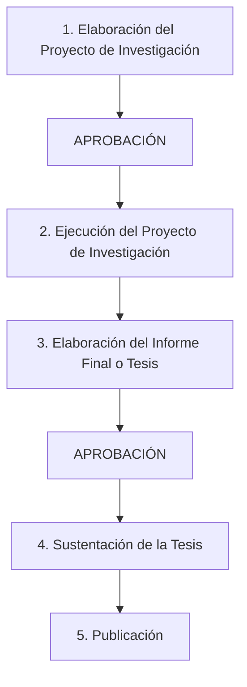

# INVESTIGACIÓN CIENTÍFICA

**UNIVERSIDAD NACIONAL DE SAN CRISTÓBAL DE HUAMANGA**  
**FACULTAD DE CIENCIAS DE LA SALUD**  
**ESCUELA PROFESIONAL DE ENFERMERÍA**  

* **Asignatura:** Proyecto de Investigación en Salud (EN 486)  
* **Docente:** Dr. Manglio Aguirre Andrade  
  * *Docente en la Categoría Principal de la UNSCH*  
  * *Experto en Salud Pública*  
  * **Correo:** manglio.aguirre@unsch.edu.pe  
  * **Teléfono:** 966102220  

---

## 1. INVESTIGACIÓN

### Etimología
* **In:** en, hacia
* **Vestigium:** huella, pista
* *Investigar es caminar hacia o hacer seguimiento de huellas o pistas.*

### Concepto
* El objetivo de la investigación es descubrir algo nuevo y para ello se requiere la aplicación formal de métodos.
* ¿Investigar es equivalente a...?

---

## 1. INVESTIGACIÓN CIENTÍFICA

> **Neil Salkind:**  
> La investigación es un proceso sistemático mediante el cual se descubren conocimientos nuevos.

### Características de la Investigación Científica:
* **Se basa en el trabajo de otros:** Se articula sobre el conocimiento científico acumulado.
* **Se puede repetir (replicabilidad):** Otros investigadores pueden reproducir los procedimientos y verificar los resultados.
* **Se puede generalizar a otras situaciones:** Sus conclusiones trascienden los casos particulares estudiados.
* **Se basa en algún razonamiento lógico y está vinculado a una teoría:** Integra marcos conceptuales coherentes.
* **Se puede hacer (viabilidad/factibilidad):** Es ejecutable con los recursos, tiempos y técnicas disponibles.
* **Genera nuevas preguntas, es incremental:** No es estática; abre nuevos campos de indagación.
* **Se sustenta en el método científico:** Emplea procedimientos rigurosos de contrastación.

---

## 2. MÉTODO CIENTÍFICO

### Definición
> **Francis Bacon:**  
> El método científico es un conjunto de reglas para observar fenómenos e inferir conclusiones a partir de dichas observaciones.

Es un procedimiento riguroso formado por una **secuencia lógica de actividades** que procura descubrir:
1. Las **características** de los fenómenos.
2. Las **relaciones internas** entre sus elementos constitutivos.
3. Sus **conexiones** con otros fenómenos de la realidad.

*La secuencia lógica está guiada por el raciocinio y la comprobación a través de la demostración y la verificación.*

---

### Veracidad y Verificabilidad en la Ciencia
Una condición fundamental de la ciencia es la veracidad y la verificabilidad. Los enunciados verificables son de diversas clases:

1. **Proposiciones singulares:**  
   *Ejemplo:* *"Este trozo de hierro está caliente"*.
2. **Proposiciones particulares o existenciales:**  
   *Ejemplo:* *"Algunos trozos de hierro están calientes"* (proposición verificablemente falsa en contextos determinados).
3. **Enunciados de leyes:**  
   *Ejemplo:* *"Todos los metales se dilatan con el calor"* (formalmente: *"Para todo $x$, si $x$ es un trozo de metal que se calienta, entonces $x$ se dilata"*).

> **Niveles de verificación:**  
> * Las proposiciones singulares y particulares pueden verificarse a menudo de manera inmediata, con el auxilio directo de los sentidos o de instrumentos que amplían su alcance.  
> * Otras veces exigen operaciones complejas que implican leyes científicas y cálculos matemáticos (por ejemplo: la medición de distancias astronómicas como la distancia media Tierra-Sol).

---

### Modo de Conocer y Proceder de la Ciencia

```
    ┌──────────────────────────┐
    │  PROBLEMA / IDEA /       │
    │  OBSTÁCULO               │
    └────────────┬─────────────┘
                 │
                 ▼
    ┌──────────────────────────┐
    │  HIPÓTESIS               │
    └────────────┬─────────────┘
                 │
                 ▼
    ┌──────────────────────────┐
    │  RAZONAMIENTO -          │
    │  DEDUCCIÓN               │
    └────────────┬─────────────┘
                 │
                 ▼
    ┌──────────────────────────┐
    │  OBSERVACIÓN, PRUEBA,    │
    │  EXPERIMENTO             │
    └────────────┬─────────────┘
                 │
                 ▼
    ┌──────────────────────────┐
    │  PRODUCCIÓN DE CIENCIA   │
    └──────────────────────────┘
```

El método científico se basa en:
1. La observación sistemática de la realidad.
2. Su medición cuantitativa y cualitativa.
3. El análisis riguroso de sus propiedades y características.
4. La elaboración formal de hipótesis explicativas.
5. Su interpretación y contrastación empírica.
6. La formulación de alternativas de acción o respuesta para transformar la realidad.

---

## 3. TIPOS DE INVESTIGACIÓN  
*(Ref. Landeau Rebeca, 2007)*

### a. Según la Finalidad
* **a.1. Investigación teórica, básica o pura:**  
  Se interesa en el descubrimiento de las leyes que rigen el comportamiento de ciertos fenómenos o eventos; intenta encontrar los principios generales que gobiernan los diversos fenómenos en los que el investigador se encuentra interesado *(Kerlinger, 1982)*.
* **a.2. Investigación aplicada:**  
  Aquella que incluye cualquier esfuerzo sistemático y socializado por resolver problemas o intervenir situaciones, aunque no sea programático, es decir, aunque no pertenezca a una trayectoria previa de investigaciones descriptivas y teóricas. Es aplicable tanto a la innovación técnica, artesanal e industrial como a la propiamente científica *(Padrón, 2006)*.

### b. Según su Carácter
* **b.1. Investigación exploratoria:** Primer acercamiento a temas poco estudiados o desconocidos.
* **b.2. Investigación descriptiva:** Caracteriza situaciones, eventos, propiedades o perfiles de personas o comunidades.
* **b.3. Investigación correlacional o *ex post facto*:** Mide el grado de relación o asociación entre dos o más variables sin manipulación directa.
* **b.4. Investigación explicativa:** Dirigida a responder por las causas de los eventos y fenómenos físicos o sociales.
* **b.5. Investigación experimental:** Manipulación deliberada de variables independientes para observar efectos en variables dependientes bajo estricto control.

### c. Según su Naturaleza
* **c.1. Investigación cuantitativa:** Recolección y análisis de datos cuantificables, medición numérica y contrastación estadística.
* **c.2. Investigación cualitativa:** Comprensión profunda de significados, vivencias, discursos y fenómenos en su contexto natural.
* **c.3. Investigación cuali-cuantitativa (Mixta):** Integración sistemática de enfoques cuantitativos y cualitativos.

### d. Según su Alcance Temporal
* **d.1. Investigación transversal (sincrónica):** Recolección de datos en un solo momento o punto temporal único.
* **d.2. Investigación longitudinal (diacrónica):** Recolección de datos a través del tiempo en períodos sucesivos para analizar evoluciones o tendencias.

### e. Según la Orientación que Asume
* **e.1. Investigación orientada a la comprobación:** Dirigida a contrastar o validar hipótesis, teorías o leyes.
* **e.2. Investigación orientada al descubrimiento:** Enfocada en generar nuevas ideas, patrones y hallazgos teóricos.
* **e.3. Investigación orientada a la aplicación:** Focalizada en dar solución inmediata o práctica a problemas reales.

---

## 4. ETAPAS DEL PROCESO DE INVESTIGACIÓN



---

## 5. COMPROMISOS SOBRE LA BIOÉTICA Y ÉTICA DE LA INVESTIGACIÓN

* **¿Cómo encontrar la verdad?... ¿Es la verdad?**
* **¿Explorando? ¿Examinando? ¿Vulnerando? ¿Manipulando?**
* **Rol de los Comités de Bioética:** Garantizar la protección de los derechos, bienestar e integridad de los sujetos participantes, el respeto irrestricto de la confidencialidad, el consentimiento informado y el cumplimiento de principios de beneficencia, no maleficencia, autonomía y justicia.

---

## 6. ESQUEMAS DE PROTOCOLOS DE INVESTIGACIÓN

### A. Esquema o Protocolo de un Proyecto de Investigación con Enfoque Cuantitativo

#### I. EL PROBLEMA DE INVESTIGACIÓN
* **1.1.** Origen del problema de investigación
* **1.2.** Delimitación del problema
* **1.3.** Formulación del problema
* **1.4.** Objetivos
  * Objetivo general
  * Objetivos específicos
* **1.5.** Justificación del estudio

#### II. MARCO TEÓRICO
* **2.1.** Antecedentes del estudio
* **2.2.** Base teórico-científica
* **2.3.** Hipótesis
* **2.4.** Identificación y operacionalización de variables

#### III. METODOLOGÍA DE INVESTIGACIÓN
* **3.1.** Tipo de investigación
* **3.2.** Tipo de diseño de investigación
* **3.3.** Área de estudio
* **3.4.** Población
* **3.5.** Muestra
* **3.6.** Técnica e instrumento de recolección de datos
* **3.7.** Plan de recolección de datos
* **3.8.** Plan de procesamiento de datos
* **3.9.** Plan de presentación y análisis de datos

#### IV. ASPECTOS ADMINISTRATIVOS
* **4.1.** Asignación de recursos
* **4.2.** Cronograma
* **4.3.** Financiamiento

#### REFERENCIAS BIBLIOGRÁFICAS

#### ANEXOS:
* Instrumento de recolección de datos.
* Matriz de consistencia.
* Validación del instrumento por juicio de expertos, consentimiento informado / autoinformado.

---

### B. Esquema o Protocolo de un Proyecto de Investigación con Enfoque Cualitativo

#### INTRODUCCIÓN

#### CAPÍTULO I: EL PROBLEMA
* Problema de investigación
* Preguntas norteadoras
* Planteamiento del problema central o formulación del enunciado del problema de investigación
* Objetivos
* Justificación

#### CAPÍTULO II: MARCO CONTEXTUAL

#### CAPÍTULO III: ABORDAJE TEÓRICO
* Antecedentes de estudio
* Descripción de las variables / categorías de estudio  
  *(Puede plantearse una hipótesis de trabajo)*

#### CAPÍTULO IV: METODOLOGÍA CUALITATIVA DEL ESTUDIO
*(Deberá seleccionarse tanto el método general como el específico)*
* **Método General:**
  * Estudios descriptivos (Demográficos, estudios de casos)
  * Estudios interpretativos
  * Estudios históricos
* **Métodos Cualitativos Específicos:**
  * Método hermenéutico
  * Método dialéctico
  * Método fenomenológico
  * Método etnográfico
  * Método de investigación-acción (I-A)
  * Método de historias de vida
  * Método dialéctico estructural
* **Procedimientos metodológicos:**
  * Selección de los informantes / muestra cualitativa
  * Técnicas e instrumentos de recolección de información
  * Plan de recolección de datos
  * Plan de procesamiento y categorización de datos
  * Plan de presentación y análisis e interpretación de resultados

#### CAPÍTULO V: ASPECTOS ADMINISTRATIVOS
* Asignación de recursos
* Cronograma
* Financiamiento

#### BIBLIOGRAFÍA

#### ANEXOS:
* Guía de entrevista / instrumentos de recolección cualitativa.
* Matriz de consistencia cualitativa.

---

*FACULTAD DE CIENCIAS DE LA SALUD - ESCUELA PROFESIONAL DE ENFERMERÍA*  
*Gracias.*
