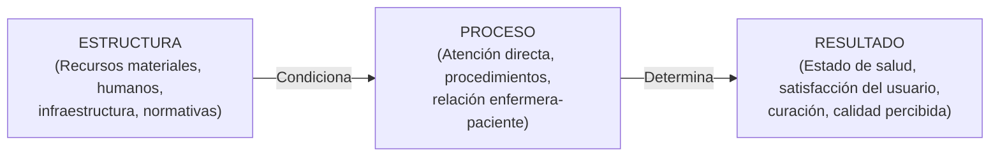

# FICHA TEÓRICA CLÁSICA: AMEDIS DONABEDIAN (1980)
## Evaluación y Monitoreo de la Calidad en los Servicios de Salud
**Cátedra:** Proyecto de Investigación en Salud (EN 486) — UNSCH  
**Docente:** Dr. Manglio Aguirre Andrade  
**Referencia Canónica (APA 7ma ed.):**  
> Donabedian, A. (1980). *Explorations in quality assessment and monitoring. Volume 1: The definition of quality and approaches to its assessment*. Health Administration Press.

---

## 1. Contexto y Relevancia Epistemológica
Avedis Donabedian es considerado el padre contemporáneo de la evaluación de la calidad en los sistemas sanitarios. Su formulación teórica trasciende la visión puramente biologicista y clínica, estableciendo que la calidad asistencial debe ser evaluada a través de una relación de causalidad sistémica compuesta por tres dimensiones interconectadas: **Estructura**, **Proceso** y **Resultado** (la Tríada de Donabedian).

---

## 2. La Tríada Conceptual de Donabedian

### A. Estructura (*Structure*)
* **Definición:** Los atributos y condiciones materiales, organizacionales y humanas en las cuales se provee la atención médica y de enfermería.
* **Componentes clave:**
  * **Recursos físicos:** Infraestructura hospitalaria, consultorios, camas, equipos biomédicos, medicamentos y material fungible.
  * **Recursos humanos:** Número y competencias del personal de salud (médicos, enfermeras, técnicos), ratios enfermera-paciente, capacitación y especialización.
  * **Estructura organizacional:** Modelos de gestión, manuales de organización y funciones (MOF), directivas sanitarias, sistemas de información y esquemas de financiamiento.
* **Regla metodológica:** Una buena estructura es condición necesaria pero no suficiente para garantizar una atención de calidad.

### B. Proceso (*Process*)
* **Definición:** El conjunto de actividades y acciones que transcurren entre el paciente y el personal asistencial durante la prestación del servicio.
* **Componentes clave:**
  * **Dimensión técnica:** Aplicación rigurosa de guías de práctica clínica (GPC), protocolos de bioseguridad, oportunidad diagnóstica y terapéutica.
  * **Dimensión interpersonal:** Calidez del trato humano, comunicación asertiva, escucha activa, empatía del profesional de enfermería, privacidad y respeto a los derechos del paciente (consentimiento informado).
* **Regla metodológica:** En la investigación cualitativa en salud, el proceso es el espacio donde se configuran las vivencias, percepciones y significados del cuidado.

### C. Resultado (*Outcome*)
* **Definición:** Los efectos tangibles e intangibles de la atención en el estado de salud y en la experiencia de las personas y poblaciones.
* **Componentes clave:**
  * **Resultados clínicos:** Recuperación de la salud, reducción de la morbilidad/mortalidad, prevención de complicaciones e infecciones asociadas a la atención de salud (IAAS).
  * **Resultados percibidos:** **Satisfacción del paciente / usuario externo**, percepción de la calidad recibida, adherencia terapéutica y confianza institucional.

---

## 3. Aplicación Práctica en Protocolos y Tesis de Enfermería (UNSCH)

1. **Para estudios sobre Calidad de Atención y Satisfacción:**
   * Donabedian sustenta la hipótesis de que las fallas en el proceso (tiempos de espera prolongados, maltrato o comunicación deficiente) impactan directamente en el resultado negativo (insatisfacción del paciente).
2. **Operacionalización de Variables:**
   * Dimensión Estructural: Disponibilidad de insumos, estado de los ambientes de triaje y hospitalización.
   * Dimensión de Proceso: Tiempo dedicado a la consejería de enfermería, oportunidad en la administración del tratamiento.
   * Dimensión de Resultado: Grado de satisfacción global (Escala de Likert o modelo SERVQUAL).
