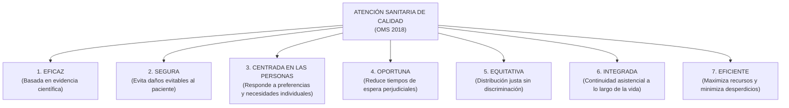

# MARCO NORMATIVO INTERNACIONAL: OMS / OCDE / BANCO MUNDIAL (2018)
## Servicios de Salud de Calidad: Un Imperativo Mundial para la Cobertura Sanitaria Universal
**Cátedra:** Proyecto de Investigación en Salud (EN 486) — UNSCH  
**Docente:** Dr. Manglio Aguirre Andrade  
**Referencia Canónica (APA 7ma ed.):**  
> Organización Mundial de la Salud [OMS], Organización para la Cooperación y el Desarrollo Económicos [OCDE], & Banco Mundial. (2018). *Delivering quality health services: A global imperative for universal health coverage*. World Health Organization. https://iris.who.int/handle/10665/272465

---

## 1. Tesis Central del Informe Mundial

El informe establece un cambio de paradigma para la salud global:
> *"La Cobertura Sanitaria Universal (CSU) no puede alcanzarse únicamente aumentando el acceso numérico o geográfico a los servicios. El acceso sin calidad es una promesa vacía. Los servicios de baja calidad cuestan vidas y despilfarran recursos valiosos."*

---

## 2. Los 7 Atributos Fundamentales de la Calidad en Salud según la OMS

Para que un sistema de salud sea considerado de calidad, la atención debe reunir obligatoriamente siete características:

1. **Eficaz (*Effective*):** Proporciona servicios basados en la evidencia científica a quienes los necesitan, evitando intervenciones inútiles o iatrogénicas.
2. **Segura (*Safe*):** Evita causar daño evitable al paciente como consecuencia de la atención de salud (bioseguridad, prevención de caídas, eventos adversos por medicamentos).
3. **Centrada en las personas (*People-centred*):** Brinda una atención que toma en consideración las preferencias, necesidades individuales, cultura y valores de los pacientes y sus familias.
4. **Oportuna (*Timely*):** Reduce los tiempos de espera nocivos y las demoras potencialmente mortales tanto para quienes reciben como para quienes prestan el servicio.
5. **Equitativa (*Equitable*):** Proporciona una atención cuya calidad no varía por razones de género, etnia, ubicación geográfica o nivel socioeconómico.
6. **Integrada (*Integrated*):** Ofrece una atención coordinada que abarca todo el espectro de servicios (promoción, prevención, tratamiento, rehabilitación y cuidados paliativos).
7. **Eficiente (*Efficient*):** Maximiza los beneficios obtenidos con los recursos disponibles y evita el despilfarro de medicamentos, tiempo e insumos.

---

## 3. Justificación y Vinculación con Prioridades Sanitarias (MINSA y Ayacucho)

* **Nivel Internacional:** Justifica la pertinencia del estudio en el marco del **Objetivo de Desarrollo Sostenible (ODS 3)** de las Naciones Unidas (*Garantizar una vida sana y promover el bienestar para todos en todas las edades*).
* **Nivel Nacional:** Sustenta la **Línea Nacional de Investigación N° 10 (MINSA RM N° 424-2025)**: *Sistemas y servicios de salud, acceso y cobertura universal*.
* **Nivel Regional:** Alineación con la **Prioridad Regional N° 10 de DIRESA Ayacucho (2025-2030)**: *Organización, acceso y calidad de los servicios de salud en zonas andinas y rurales*.
