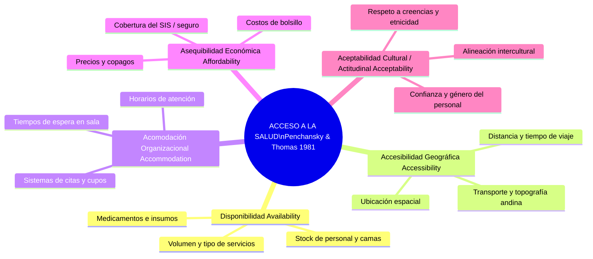

# FICHA TEÓRICA CLÁSICA: ROY PENCHANSKY & J. WILLIAM THOMAS (1981)
## El Concepto de Acceso: Las 5 Dimensiones del Ajuste Paciente-Sistema
**Cátedra:** Proyecto de Investigación en Salud (EN 486) — UNSCH  
**Docente:** Dr. Manglio Aguirre Andrade  
**Referencia Canónica (APA 7ma ed.):**  
> Penchansky, R., & Thomas, J. W. (1981). The concept of access: Definition and relationship to consumer satisfaction. *Medical Care*, 19(2), 127-140. https://doi.org/10.1097/00005650-198102000-00001

---

## 1. Definición Taxonómica del "Acceso"

Penchansky y Thomas revolucionaron la literatura de servicios de salud al superar la definición simplista de acceso como "mera presencia física o entrada a un centro médico". 

Los autores definen el **Acceso** como:
> *"El grado de ajuste o acoplamiento (fit) entre las características y expectativas de los usuarios y las características y recursos de los prestadores y del sistema de salud."*

Cuando este ajuste no es armónico, surgen **barreras de acceso**, las cuales deterioran la utilización oportuna de los servicios e inducen insatisfacción en el paciente.

---

## 2. Las 5 Dimensiones del Acceso a los Servicios de Salud

### 1. Disponibilidad (*Availability*)
* **Relación:** Volumen y tipo de servicios existentes frente al volumen y necesidades de los usuarios.
* **Indicadores en salud:** Número de médicos y enfermeras por 1,000 habitantes, disponibilidad de camas obstétricas/pediátricas, stock permanente de medicamentos esenciales en farmacia.

### 2. Accesibilidad Geográfica (*Accessibility*)
* **Relación:** Localización geográfica de los servicios de salud respecto al lugar de residencia o trabajo de los usuarios.
* **Realidad en Ayacucho:** Distancia en kilómetros, tiempo de traslado en horas desde comunidades rurales o anexos altoandinos hacia los puestos y centros de salud de la cabecera distrital, accesibilidad vial y costos de transporte.

### 3. Acomodación / Organización (*Accommodation*)
* **Relación:** La forma en que los servicios de salud están organizados para recibir a los pacientes y la capacidad del usuario para acoplarse a dicha organización.
* **Indicadores críticos:** Tiempos de espera antes de ser atendido en triaje o consulta externa, flexibilidad de horarios de atención, colas a primeras horas de la madrugada para obtener un cupo, trámites burocráticos engorrosos.

### 4. Asequibilidad Económica (*Affordability*)
* **Relación:** El costo financiero total del servicio (precio de la consulta, exámenes auxiliares, recetas farmacológicas) frente a la capacidad de pago del usuario y su familia.
* **Contexto peruano:** Cobertura efectiva del Seguro Integral de Salud (SIS) frente a los "gastos de bolsillo" que los pacientes deben asumir por desabastecimiento hospitalario.

### 5. Aceptabilidad Intercultural / Actitudinal (*Acceptability*)
* **Relación:** La concordancia entre las características socioculturales, actitudes y valores de los pacientes y los de los prestadores de salud.
* **Crucial para Ayacucho y Huamanga:** Respeto a las pacientes quechua-hablantes, pertinencia cultural en la atención del parto vertical, trato digno sin discriminación por origen étnico, vestimenta o nivel socioeducativo.

---

## 3. Conexión Teórica entre Acceso y Calidad Percibida
Penchansky y Thomas demostraron empíricamente que **el acceso y la satisfacción no son variables aisladas**:
* Un déficit en la *Acomodación* (largos tiempos de espera) genera una percepción inmediata de incompetencia y falta de calidad técnica/organizacional.
* Una falta de *Aceptabilidad* quebranta la dimensión de *Empatía* del modelo SERVQUAL y desencadena abandono del tratamiento o desconfianza en el sistema asistencial.
