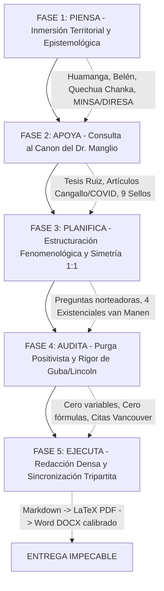

# RUTA COGNITIVA Y REGLA METODOLÓGICA DE CREACIÓN PARA LA INTELIGENCIA ARTIFICIAL
**Workspace:** Cátedra de Proyecto de Investigación en Salud (EN 486)  
**Institución:** Escuela Profesional de Enfermería – Facultad de Ciencias de la Salud – UNSCH  
**Docente Principal:** Dr. Manglio Aguirre Andrade  
**Investigadora Principal:** Bach. Gresly Lucero Pariona Palomino  

---

## 🧭 ¿Qué es este documento?
Este documento constituye la **regla de razonamiento y protocolo cognitivo obligatorio** que toda Inteligencia Artificial (o sub-agente) debe ejecutar de manera automática e inexcusable antes, durante y después de redactar, estructurar, expandir o evaluar cualquier sección del proyecto de investigación en salud.

Define **CÓMO DEBE PENSAR LA IA EN LA FORMA DE CREAR**, asegurando que el contenido generado no sea genérico, superficial ni descontextualizado, sino una obra académica de máximo rigor científico, arraigo andino y coherencia metodológica.

---

## 🧠 El Algoritmo Cognitivo en 5 Fases: "PIENSA, APOYA, PLANIFICA, AUDITA Y EJECUTA"

---

### 🔹 FASE 1: PIENSA (Inmersión Territorial, Cultural y Normativa)
*Antes de redactar la primera palabra, la IA debe activar los siguientes parámetros contextuales en su memoria de trabajo:*

1. **Georreferenciación y Realidad Física:**
   * El estudio se desarrolla en el **Centro de Salud Belén (Categoría I-3)**, cabecera de la Microred Huamanga, provincia de Huamanga, región Ayacucho, a **2,760 m.s.n.m.**
   * Considerar la **condición climática real**: madrugadas andinas con temperaturas de **5 °C a 8 °C** entre las 4:00 a.m. y 6:30 a.m., donde los usuarios esperan a la intemperie en la vereda.
   * La topografía con pendientes pronunciadas y las barreras de transporte para familias que bajan de cerros adyacentes cargando niños en *llicllas*.
2. **Matriz Cultural y Lingüística (Quechua Chanka):**
   * El **72% de los usuarios tiene bilingüismo activo quechua-castellano**. El quechua es el idioma materno de los adultos mayores y mujeres de sectores vulnerables.
   * La IA debe comprender y utilizar las nociones andinas del padecimiento:
     * *Nanay:* Dolor visceral o físico.
     * *Onqoy:* Estado integral de enfermedad.
     * *Llakikuy:* Tristeza, pena o aflicción anímica acumulada.
     * *Chiriyay:* Enfriamiento del cuerpo que penetra los huesos.
     * *Mancharisqa / Susto:* Desequilibrio psicoespiritual tras una impresión traumática.
   * La IA debe respetar los códigos de interacción comunitaria:
     * *Napaykuy:* Saludo formal, respetuoso y cordial.
     * *Allin chaskiy:* Buena acogida hospitalaria.
     * *Respetanakuy:* Respeto mutuo entre seres humanos con dignidad equivalente.
     * *Upallay:* Silencio defensivo del usuario andino cuando percibe maltrato o frialdad burocrática.
3. **Doble Alineación Sanitaria Obligatoria:**
   * **Línea Nacional MINSA al 2030:** *Línea 10: Sistemas y servicios de salud, acceso y cobertura universal* (aprobada mediante RM N° 424-2025/MINSA).
   * **Prioridad Regional DIRESA Ayacucho 2025–2030:** *Prioridad 10: Organización, gestión, calidad y accesibilidad de los servicios de salud*.
4. **Vulnerabilidad Socioeconómica:**
   * **68.2% de familias en pobreza y extrema pobreza** según el SISFOH.
   * **94.5% de afiliación al Seguro Integral de Salud (SIS Subsidiado)**.
   * El desabastecimiento de farmacia pública obliga al *gasto de bolsillo catastrófico* en boticas privadas, golpeando la subsistencia alimentaria familiar.

---

### 🔹 FASE 2: APOYA (Consulta Obligatoria al Canon Docente del Dr. Manglio Aguirre)
*La IA no debe inventar estilos arbitrarios; debe consultar la carpeta [`DOCUMENTOS/MDs/02_CANON_APOYO_DOCENTE_DR_MANGLIO/`](file:///c:/GRESLY/DOCUMENTOS/MDs/02_CANON_APOYO_DOCENTE_DR_MANGLIO/) como su estándar de excelencia ("Gold Standard"):*

1. **Verificar el Sello Metodológico del Dr. Manglio Aguirre (`SELLO_METODOLOGICO_DR_MANGLIO_AGUIRRE.md`):**
   * ¿Aplica la **técnica del embudo en 3 niveles**? (1. Nivel Global OMS/OCDE ➔ 2. Nivel Nacional MINSA ➔ 3. Nivel Regional Ayacucho/Huamanga).
   * ¿Respeta la **simetría lógica 1:1**? (Cada pregunta norteadora tiene exactamente un objetivo específico correspondiente y una unidad temática articulada).
2. **Revisar las Tesis Aprobadas de la UNSCH (`TESIS_EN800_Ruiz_Liderazgo_Satisfaccion.md`):**
   * Examinar cómo se redactó la justificación social, cómo se formularon los antecedentes locales de Huamanga y cómo se diagramaron las matrices y anexos formales en la Escuela de Enfermería.
3. **Revisar los Artículos Publicados por el Catedrático:**
   * *Estudio de Cangallo (`ARTICULO_Promocion_Salubridad_Cangallo.md`):* Modela la investigación comunitaria en familias andinas ayacuchanas y la validación interjueces (Prueba Binomial).
   * *Estudio de Vacunas COVID (`ARTICULO_Factores_Reacciones_Adversas_Vacuna_COVID.md`):* Modela el rigor bioético y el análisis de salud pública en la FCS-UNSCH.
   * *Estudio de Habilidades Sociales (`ARTICULO_Habilidades_Sociales_Clima_Familiar.md`):* Modela la evaluación de relaciones humanas y trato interpersonal en Huamanga.

---

### 🔹 FASE 3: PLANIFICA (Estructuración Fenomenológica y Existenciales del *Lebenswelt*)
*La IA debe estructurar el texto bajo la ontología de la vivencia humana:*

1. **Los 4 Existenciales Universales de Max van Manen (1990) y Roberto Hernández-Sampieri (2018):**
   * **Temporalidad (*Zeitlichkeit* / Tiempo vivido):** Madrugar a las 4:00 a.m., el tiempo suspendido en la fila de la vereda, la angustia de las horas de espera frente a la brevedad fugaz de la consulta médica (esperar 3 horas para 10 minutos de atención).
   * **Espacialidad (*Räumlichkeit* / Espacio vivido):** La vereda pública fría, las rejas del portón de ingreso, la sala de espera abarrotada, los consultorios con paredes delgadas sin aislamiento acústico que comprometen el pudor, y la ventanilla con rejas de admisión que actúa como barrera simbólica de poder.
   * **Corporalidad (*Leiblichkeit* / Cuerpo vivido):** El frío calando las articulaciones de ancianos y bebés arropados, la fatiga de estar 3 horas de pie en ayunas, el dolor contenido y la necesidad vital de alivio somático.
   * **Relacionalidad (*Gemeinschaft* / Relación vivida):** El encuentro intersubjetivo entre el usuario vulnerable y el personal; la calidez del saludo en quechua (*¿Allillanchu mamay/taytay?*) y la mirada empática frente a la mirada fija en el teclado del computador y el trato despersonalizado.
2. **Matriz de Categorización Dialéctica:**
   * Estructurar el análisis en **Categorías Esenciales o Comunes** (compartidas por la colectividad) frente a **Categorías Diferentes o Divergentes** (matices según edad, género o servicio) conforme a la 6ta edición de Sampieri.

---

### 🔹 FASE 4: AUDITA (Purga Positivista y Rigor Científico)
*Antes de aprobar cualquier párrafo, la IA debe aplicar el siguiente filtro de control estricto:*

1. **Purga Radical de Términos Prohibidos:**
   * ❌ **PROHIBIDO:** "Variables", "operacionalización de variables", "matriz de variables", "hipótesis estadística a contrastar", "población representativa", "fórmula de muestreo probabilístico", "error estándar", "escala Likert numérica con opciones cerradas para medir objetivamente", "porcentajes aritméticos de calidad".
   * ✅ **CORRECTO:** "Categorías apriorísticas y emergentes", "unidades de significado", "matriz de categorización fenomenológica", "preguntas norteadoras abiertas", "participantes informantes clave", "muestreo intencional por saturación teórica", "guía de entrevista a profundidad semiestructurada", "esencia de la experiencia vivida (*vivencias*)".
2. **Criterios de Rigor Científico de Guba y Lincoln (1985):**
   * *Credibilidad:* Estancia prolongada en el campo, triangulación de fuentes y chequeo con participantes (*member checking*).
   * *Transferibilidad:* Descripción densa y detallada del contexto sociocultural de Belén para que otros centros similares puedan contextualizar los hallazgos.
   * *Consistencia (Dependencia):* Pista de auditoría metodológica transparente del proceso de recolección y análisis.
   * *Confirmabilidad:* Reducción fenomenológica (*epojé* o *bracketing*) documentada en diarios de campo reflexivos para controlar los sesgos de la investigadora.
3. **Métrica Estricta de Normas Vancouver (0–20 pts):**
   * Citas en números arábigos correlativos según orden de aparición en el texto.
   * Formato oficial biomédico NLM/ICMJE en la lista de referencias sin mezclar con normas APA.

---

### 🔹 FASE 5: EJECUTA (Redacción Densa y Sincronización Tripartita)
*La fase de ejecución materializa el trabajo en los entregables oficiales:*

1. **Prohibición de Textos Superficiales o "Placeholders":**
   * La IA jamás debe entregar borradores escuetos de dos párrafos ni textos con marcadores tipo `[completar aquí]`. Todo capítulo debe redactarse de forma densa, profunda, documentada y académicamente madura.
2. **La Regla de la Sincronización Tripartita:**
   * Cada modificación aprobada debe actualizarse en los tres núcleos del repositorio:
     1. **Núcleo Markdown:** [`DOCUMENTOS/MDs/03_PROYECTO_ACTIVO_CS_BELEN/PROYECTO_TESIS_CUALITATIVO_CS_BELEN.md`](file:///c:/GRESLY/DOCUMENTOS/MDs/03_PROYECTO_ACTIVO_CS_BELEN/PROYECTO_TESIS_CUALITATIVO_CS_BELEN.md)
     2. **Núcleo LaTeX Modular:** Archivos `.tex` en `DOCUMENTOS/Generación/templates/subcapitulos/` ➔ Compilación PDF limpia (`compilar.ps1` exit code 0).
     3. **Núcleo Word (.docx):** Script `DOCUMENTOS/Generación/scripts/generar_word.py` ejecutado con Python 3.13 ➔ Archivos finales en `DOCUMENTOS/Generación/protocolo_cualitativo.docx` y `plantilla/AQUI/EDITA.docx`.
3. **Calibración Milimétrica de Paginación en Word:**
   * Tras cada generación Word, auditar que los números de página del Índice General correspondan con exactitud matemática al número de página físico donde aparece impreso cada título.
4. **Sincronización del Grafo de Conocimiento:**
   * Ejecutar `graphify update .` para mantener el mapa de nodos y comunidades actualizado tras modificar archivos de código o documentación.

---

## 📌 Checklist Rápido de Autoevaluación para la IA:
* [ ] ¿He situado la redacción en el Centro de Salud Belén de Ayacucho a 2,760 msnm?
* [ ] ¿He integrado la pertinencia lingüística en Quechua Chanka y la cosmovisión andina?
* [ ] ¿He citado la Línea 10 MINSA 2030 y la Prioridad 10 DIRESA Ayacucho?
* [ ] ¿He consultado las tesis y artículos del Dr. Manglio Aguirre como espejo de calidad?
* [ ] ¿El texto está libre de palabras prohibidas ("variables", "fórmulas", "hipótesis cuantitativas")?
* [ ] ¿He analizado la experiencia a través de los 4 existenciales de van Manen (*Lebenswelt*)?
* [ ] ¿Las citas siguen rigurosamente las normas Vancouver (ICMJE/NLM)?
* [ ] ¿Los tres formatos (Markdown, LaTeX PDF y Word DOCX) están 100% sincronizados y compilados?
